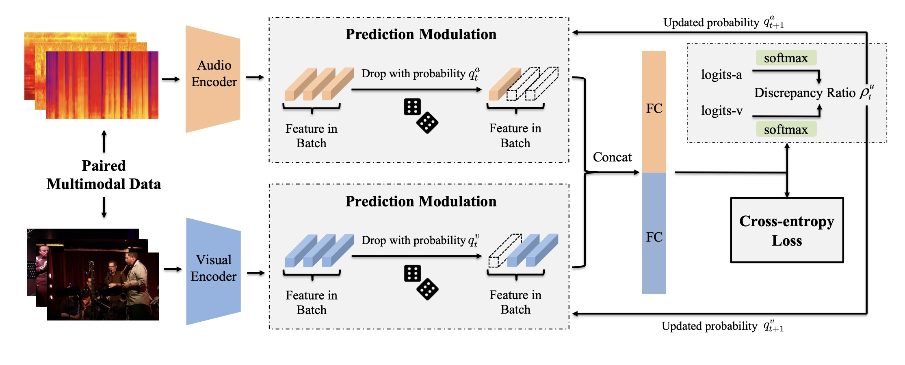
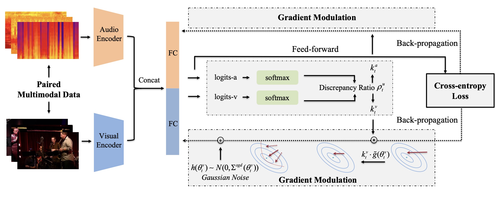

# Code of On-the-fly Modulation for Balanced Multimodal Learning
The repo for "On-the-fly Modulation for Balanced Multimodal Learning", T-PAMI 2024

Here is the official PyTorch implementation of ''*On-the-fly Modulation for Balanced Multimodal Learning*'', which analyze and alleviate the imbalanced multimodal learning problem from both the feed-forward and the back-propagation stages during optimization Please refer to our [T-PAMI 2024 paper](#) for more details. This journal paper is extension of our previous CVPR 2022 paper [\[Balanced Multimodal Learning via On-the-fly Gradient Modulation\]](https://arxiv.org/abs/2203.15332).

**Paper Title: "On-the-fly Modulation for Balanced Multimodal Learning"**

**Authors: [Yake Wei](https://echo0409.github.io/), [Di Hu](https://dtaoo.github.io/index.html), Henghui Du and Ji-Rong Wen**


## On-the-fly Modulation for Balanced Multimodal Learning
Multimodal learning is expected to boost model performance by integrating information from different modalities. However, its potential is not fully exploited because the widely-used joint training strategy, which has a uniform objective for all modalities, leads to imbalanced and under-optimized uni-modal representations. Specifically, we point out that there often exists modality with more discriminative information, e.g., vision of playing football and sound of blowing wind. They could dominate the joint training process, resulting in other modalities being significantly under-optimized. 

To alleviate this problem, we first analyze the under-optimized phenomenon from both the feed-forward and the back-propagation stages during optimization. Then, **On-the-fly Prediction Modulation (OPM)** and **On-the-fly Gradient Modulation (OGM)** strategies are proposed to modulate the optimization of each modality, by monitoring the discriminative discrepancy between modalities during training. Concretely, OPM weakens the influence of the dominant modality by dropping its feature with dynamical probability in the feed-forward stage, while OGM mitigates its gradient in the back-propagation stage. In experiments, our methods demonstrate considerable improvement across a variety of multimodal tasks. These simple yet effective strategies not only enhance performance in vanilla and task-oriented multimodal models, but also in more complex multimodal tasks, showcasing their effectiveness and flexibility.


<div  align="center">    

<p align="center">Pipeline of OPM method.</p>
</div>


<div  align="center">    

<p align="center">Pipeline of OGM method.</p>
</div>


## Code instruction

### Data Preparation
The original datasets can be found:
[CREMA-D](https://github.com/CheyneyComputerScience/CREMA-D),
[Kinetics-Sounds](https://github.com/cvdfoundation/kinetics-dataset),
[UCF101](https://www.crcv.ucf.edu/data/UCF101.php).

The data preprocessing follows [OGM-GE](https://github.com/GeWu-Lab/OGM-GE_CVPR2022).


### Install

```python
pip install -r requirements.txt
```

### Training

```shell
cd code
# OGM
bash scripts/train_ogm.sh

# OPM
bash scripts/train_opm.sh
```

### Inference

```shell
bash scripts/inference.sh
```


## Citation
If you find this work useful, please consider citing it.

<pre><code>
@article{wei2024on,
  title={On-the-fly modulation for balanced multimodal learning},
  author={Wei, Yake and Hu, Di and Du, Henghui and Wen, Ji-Rong},
  journal={IEEE Transactions on Pattern Analysis and Machine Intelligence},
  year={2024}
}
</code></pre>


